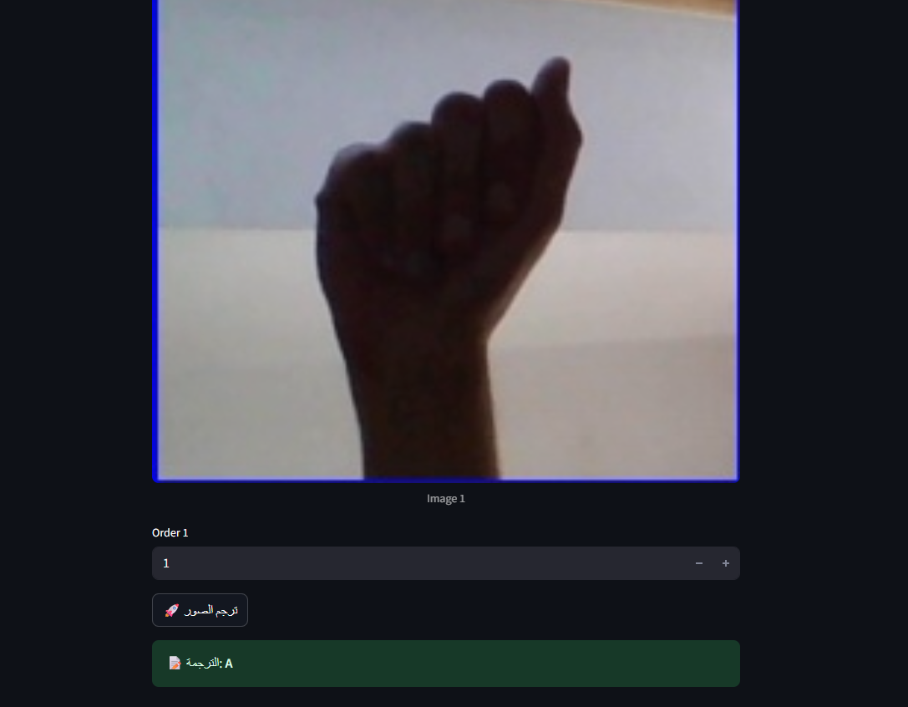

# 🖐️ Sign Language Recognition (ELVO)

A simple **Flask** web application for translating sign language from images.  
Users can upload up to **6 images** and specify their order. The system then displays the predicted translation.

---

## 🚀 Features
- Clean and simple web interface.
- Upload up to 6 images at once.
- Specify the order of the uploaded images.
- Display the final translation inside a styled result box.

---

## 📂 Project Structure

-split 
-dataset 
-model 
-train 
-evaluation 
-gui 

data source: https://www.kaggle.com/datasets/grassknoted/asl-alphabet/data

